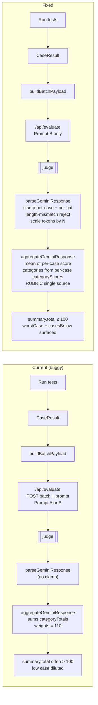
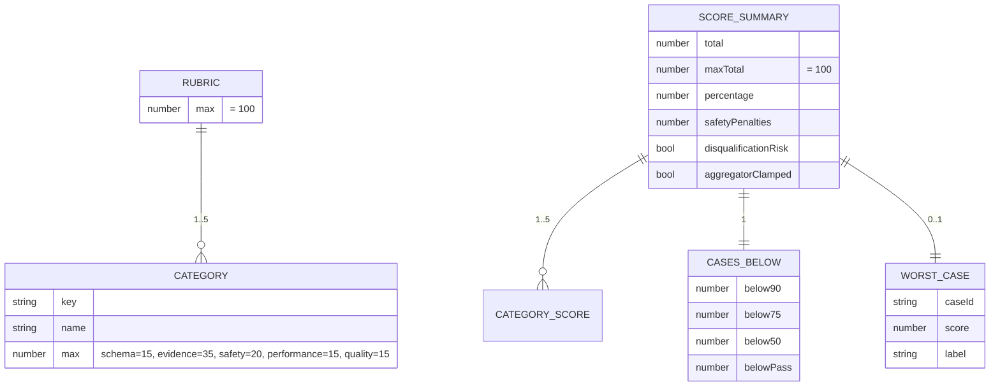

## Plan: Fix evaluation scoring correctness

**TL;DR**
Two structural bugs in `src/lib/scoreCalculator.ts` cause the symptoms you saw: weights are hard-coded to a 110-point scale (`15 + 35 + 20 + 20 + 20`) while `maxTotal = 100`, and the aggregate ignores the per-case `score` (0–100) field that the judge already returns — it only averages per-category sums the model writes into `categoryTotals`. The fix is to compute the total from per-case `score`, rebuild category breakdowns locally from per-case `categoryScores`, lock the rubric to one canonical definition (**15 + 35 + 20 + 15 + 15 = 100**), and standardize on **Prompt B** as the only judge prompt.

---

### Decisions locked
- **Rubric:** 5 categories with maxima 15 / 35 / 20 / 15 / 15 = **100**.
  - Deployment & Documentation is dropped.
  - Performance & Reliability = 15.
  - Response Quality = 15.
- **Judge prompt:** **Prompt B only.** Prompt A is no longer used; its file can stay as a reference but `PROMPT_VERSION` is forced to `"B"`.

---

### Rubric (locked)
```ts
export const RUBRIC = {
  categories: [
    { key: "schema",      name: "API Contract & Schema",     max: 15 },
    { key: "evidence",    name: "Evidence Reasoning",        max: 35 },
    { key: "safety",      name: "Safety & Escalation",       max: 20 },
    { key: "performance", name: "Performance & Reliability", max: 15 },
    { key: "quality",     name: "Response Quality",          max: 15 },
  ] as const,
};
export const RUBRIC_MAX = RUBRIC.categories.reduce((s,c) => s + c.max, 0); // 100
```
Runtime guard: `RUBRIC_MAX === 100` or throw at module load.

---

### Root-cause recap
1. `scoreCalculator.ts:12–16` declares 5 categories whose declared `weight` sums to **110**, but `maxTotal = 100` → guaranteed ≥10pt over-cap on a perfect run.
2. `summary.total = categories.reduce((s,c) => s + c.score, 0)` averages `categoryTotals.{cat}.score` across cases. Because the judge is free to award per-case scores above the rubric (e.g. 22/20 on Quality), the displayed total regularly exceeds 100 with no clamp.
3. `parseGeminiResponse` (`src/app/api/evaluate/route.ts:78–108`) does not clamp `e.score` or per-case `categoryScores`. Bad numbers flow straight into the UI.
4. Per-case `score` (already shown per row in `TestCaseResult.tsx:48`) is **never** used by the aggregator — only `categoryTotals` is. So a 45/100 case only moves one category average by `45/N ≈ 7` points at N=6, invisible at the dashboard level.
5. Prompt A (`promptA.ts`) and Prompt B (`promptB.ts`) disagree on weights and on whether Deployment exists. With this plan, **Prompt B becomes canonical** and Prompt A is no longer wired in.
6. `maxOutputTokens: 8192` plus a regex `\{[\s\S]*\}` parser silently accepts truncated JSON — categories can be missing without any error path.

---

### Steps

1. **Create `src/lib/rubric.ts`** exporting `RUBRIC` (5 categories, maxima 15/35/20/15/15) and `RUBRIC_MAX = 100` with a module-load guard that the sum is 100.

2. **Rewrite `src/lib/scoreCalculator.ts`** (`aggregateGeminiResponse`) — depends on 1:
   - Drop reliance on `response.categoryTotals`. Iterate `response.evaluations`, clamp each `categoryScores[key]` to `[0, categoryMax]` using `RUBRIC`, and average across cases per category.
   - Compute `summary.total` as the **mean of per-case `score`** (clamped `[0, 100]` per case). Round to 1 decimal.
   - `summary.percentage = round((total / 100) * 100)` with a defensive `Math.min(100, …)` and `aggregatorClamped` flag.
   - `summary.categories[]` rebuilt from per-case `categoryScores` (so displayed per-category bars always match the total).
   - Surface `summary.casesBelow = { below90, below75, below50, belowPass }` and `summary.worstCase = { caseId, score, label }`.
   - Continue to expose `safetyPenalties` and `disqualificationRisk`.

3. **Tighten `src/app/api/evaluate/route.ts` `parseGeminiResponse`** — depends on 1, 2:
   - Clamp `e.score` to `[0, 100]`.
   - Clamp `e.categoryScores[key]` to `[0, categoryMax]` using `RUBRIC`.
   - Reject if `parsed.evaluations.length !== cases.length`.
   - Reject if any required category is missing in `categoryScores`.
   - Keep `categoryTotals` on the response type for backward compatibility but stop using it in the aggregator.
   - **Force Prompt B:** `const PROMPT_VERSION = "B" as const;` and call `buildPromptB` unconditionally. Keep Prompt A's file as a reference but never import it from the route.

4. **Update `src/lib/prompts/promptB.ts`** — depends on 1:
   - Read `RUBRIC` at build time so the prompt's category list and maxima come from the single source of truth.
   - Change Performance & Reliability from `0–20` to `0–15`, Response Quality from `0–20` to `0–15` (keeps everything on the 100-point scale).
   - Drop Deployment & Documentation (its criteria fold into Quality as "official channels" and "API reachability" if needed; or simply omit — recommend omit).
   - Add a hard instruction: "Per-case `score` MUST equal the sum of `categoryScores`, and each category MUST be within `[0, categoryMax]`."

5. **Mark `src/lib/prompts/promptA.ts` as deprecated** (depends on 3): add a header comment "REFERENCE ONLY — not used by the evaluator" and remove the import from `src/app/api/evaluate/route.ts`. (Optional follow-up: delete the file once nothing imports it.)

6. **Scale `maxOutputTokens` and add retry-on-incomplete in `/api/evaluate`** — depends on 3:
   - `maxOutputTokens = 8192 + cases.length * 512`, capped at 32000 (`src/app/api/evaluate/route.ts:48`).
   - Replace `text.match(/\{[\s\S]*\}/)` with a stricter parser:
     - Strip markdown fences (` ```json … ``` `) before extraction.
     - If incomplete (`evaluations.length < cases.length`), retry once with the same prompt and an explicit "continue from where you stopped" instruction.
     - If still incomplete, return a structured 502 with the partial payload and an error code.

7. **Update `src/lib/types.ts`** — depends on 2: add `casesBelow`, `worstCase`, `aggregatorClamped` to `ScoreSummary`.

8. **Update `src/components/ScoreDashboard.tsx`** — depends on 2, 7:
   - Show `summary.total / 100` exactly (no over-cap).
   - Show worst-case indicator ("Lowest case: &lt;id&gt; at &lt;score&gt;/100").
   - Show `casesBelow90` / `casesBelow50` counters so a 45/100 case is visible without scrolling.
   - Gauge feeds off `summary.percentage` (already clamped).

9. **Update `src/components/CategoryBreakdown.tsx`** — depends on 2, parallel with 8: render only the 5 categories in `RUBRIC`, sorted in rubric order, using per-case-averaged value. Add a per-category "worst case" tooltip.

10. **Update `src/components/ExportReport.tsx`** — depends on 7, parallel with 8, 9: include `worstCase`, `casesBelow`, and `aggregatorClamped` in exported JSON / Markdown.

11. **Verification** (manual, with a mix of passing and failing cases):
    - **Symptom 1 check:** 1 case at 40/100 + 5 cases at 95/100. Expected: `summary.total` ∈ [78, 82], `summary.percentage` ∈ [78, 82], worst-case indicator points at the 40, no value > 100.
    - **Symptom 2 check:** Force the judge to award `quality: 22`. Expected: clamped to 15 before averaging; `summary.total` ≤ 100.
    - **Length-mismatch check:** Truncate the judge response at 50% of evaluations. Expected: 502 after one retry, dashboard shows error banner, no partial score surfaces.
    - **Rubric check:** Sum of `categories[].score` ≈ `summary.total` (±0.2 rounding).
    - **Per-case consistency check:** For each `evaluations[i]`, `score` ≈ sum of `categoryScores[key]` (±1). Mismatches surfaced as a warning row.
    - **Prompt-version check:** `GET /api/evaluate` returns `{ promptVersion: "B" }` regardless of env var.

---

### Relevant files
- `src/lib/rubric.ts` — **new**, single source of truth (step 1)
- `src/lib/scoreCalculator.ts` — rewrite aggregator (steps 2, 7)
- `src/lib/types.ts` — add `casesBelow`, `worstCase`, `aggregatorClamped` (step 7)
- `src/app/api/evaluate/route.ts` — clamp at parse, length check, retry on incomplete, scale tokens, force Prompt B (steps 3, 6)
- `src/lib/prompts/promptB.ts` — align with `RUBRIC` (step 4)
- `src/lib/prompts/promptA.ts` — mark deprecated (step 5)
- `src/components/ScoreDashboard.tsx` — worst-case + below-threshold counters (step 8)
- `src/components/CategoryBreakdown.tsx` — render rubric categories only (step 9)
- `src/components/ExportReport.tsx` — include new fields (step 10)
- `src/components/TestCaseResult.tsx` — already shows per-case `score`; verify formatter uses `score/maxScore` (no change expected)

---

### Diagrams

**Data flow (current vs. fixed)**


**Sequence: one batch request**
```mermaid
sequenceDiagram
  participant UI as page.tsx
  participant Route as /api/evaluate
  participant Judge as judge model
  participant Agg as scoreCalculator
  participant Dash as ScoreDashboard

  UI->>Route: POST { cases: BatchEvalCase[] }
  Route->>Route: force Prompt B, size tokens
  Route->>Judge: generateContent(promptB + RUBRIC, maxTokens = 8192 + N*512)
  Judge-->>Route: text (JSON or partial)
  Route->>Route: strip fences, extract JSON
  alt parse fails or evaluations.length &lt; cases.length
    Route->>Judge: retry once (continue instruction)
    Judge-->>Route: text
  end
  Route->>Route: clamp e.score to [0,100], categoryScores to [0,max]
  Route-->>UI: GeminiBatchResponse (validated)
  UI->>Agg: aggregateGeminiResponse(response)
  Agg->>Agg: mean(e.score), avg per category from per-case categoryScores
  Agg->>Agg: build summary.total (&le; 100), worstCase, casesBelow
  Agg-->>UI: ScoreSummary
  UI->>Dash: render(total, %, worstCase, casesBelow)
```

**Rubric + summary shape**


---

### Risks
- Changing displayed weights changes historical report exports. Mitigation: keep `summary.maxTotal` always equal to `RUBRIC_MAX`.
- Tightening `parseGeminiResponse` may reject responses that previously slipped through. Mitigation: length-mismatch retry covers the common truncation case; remaining rejections surface clear errors instead of wrong numbers.
- Removing Prompt A from the live path means historical outputs that referenced Deployment scoring will not reproduce. Mitigation: mark Prompt A as deprecated reference rather than deleting it immediately.
- Switching to per-case mean shifts numeric results for everyone, so don't benchmark old vs new outputs without a baseline run stored.
